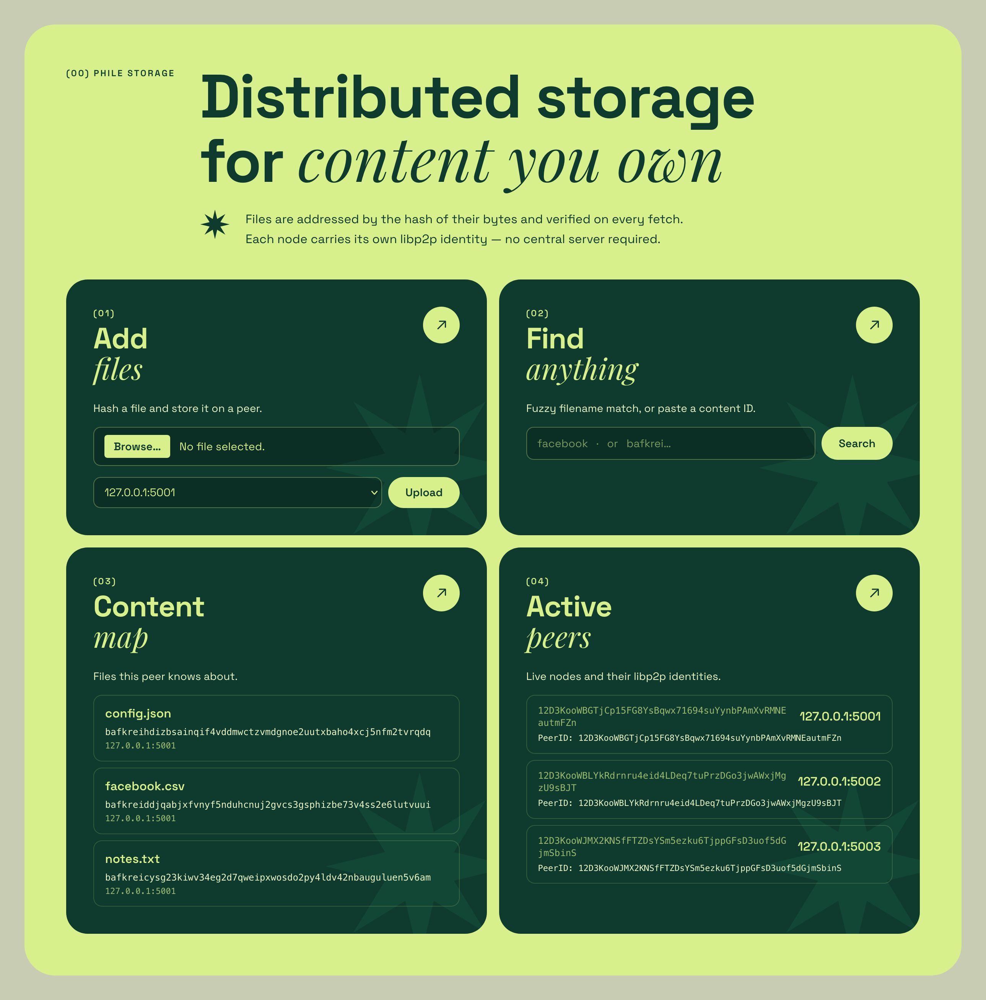

# 🗂️ Phile Storage

A peer-to-peer, **content-addressed** file sharing system built with Go and React. Files are addressed by the hash of their bytes (a CID), fetched over **libp2p**, and verified on arrival — so a peer can never hand you tampered data. Runs with **zero external infrastructure** by default.



---

## What makes it tick

- **Content addressing (CIDs).** A file's address is the fingerprint of its bytes (CIDv1, SHA-256). Identical files dedupe automatically, content is immutable, and any peer can verify it received the right bytes.
- **Trustless retrieval.** Every cross-peer fetch re-hashes the bytes against the requested CID and rejects a mismatch — corrupted or swapped content is never served.
- **libp2p networking.** Each node has a cryptographic **PeerID** (keypair-derived identity, persisted across restarts), discovers others via **mDNS**, and routes content through a **Kademlia DHT** (`Provide` / `FindProviders` by CID) over a custom `/phile/fetch/1.0.0` stream protocol.

---

## Two modes

The web3 stack (libp2p) is always on. The **centralized index** (etcd + Redis) is optional, controlled by one env var.

| Mode | When | Peer discovery | Content index | Infra needed |
|------|------|----------------|---------------|--------------|
| **Decentralized** *(default)* | `PHILE_USE_ETCD_REDIS` unset | libp2p mDNS + DHT | DHT (by CID) + node-local name map | **None** |
| **Centralized** | `PHILE_USE_ETCD_REDIS=true` | etcd registry | Redis (global file map + name→CID) | Docker (etcd + Redis) |

In decentralized mode the global File Map is a **local view** (each node only knows the names of files it uploaded); content still moves freely by CID across the network. Centralized mode keeps a shared, global file index.

### Persistence

Each peer owns a stable directory `data/peer-<port>/` that survives restarts:

- **Blocks** live under `blocks/<cid>` and are re-announced to the DHT on startup.
- **PeerID** is loaded from `identity.key`, so a node keeps the same cryptographic identity across restarts.
- **Name → CID index** (decentralized mode) is persisted to `names.json`. In centralized mode the index lives in Redis.

Delete a peer's `data/peer-<port>/` directory (or run `rm -rf data`) to reset it.

---

## 🚀 Getting started

**Prerequisites:** Go 1.24+, Node 18+ / npm. Docker only if you want centralized mode.

### Decentralized (default — no Docker)

```bash
cd backend
make build
./bin/phile-storage -peers=3        # 3 peers: HTTP 5001-5003, libp2p 6001-6003

cd ../frontend
npm install
npm run dev
```

### Centralized (etcd + Redis)

```bash
cd backend
make start-docker                   # etcd + Redis containers
PHILE_USE_ETCD_REDIS=true ./bin/phile-storage -peers=3
```

Open the dashboard at **http://localhost:5173**. Upload a file, watch its CID appear, then download it from another peer and see it propagate.

### Configuration

All optional, with sane defaults:

| Env var | Default | Purpose |
|---------|---------|---------|
| `PHILE_USE_ETCD_REDIS` | `false` | Enable the centralized etcd+Redis backend |
| `ETCD_ENDPOINTS` | `localhost:2379` | etcd endpoints (centralized mode) |
| `REDIS_ADDR` | `localhost:6379` | Redis address (centralized mode) |
| `BASE_PORT` | `5001` | First peer's HTTP port |
| `MAX_UPLOAD_SIZE` | `104857600` | Max upload bytes (100 MiB) |
| `CORS_ORIGINS` | `http://localhost:5173` | Allowed CORS origins |

---

## HTTP API (per peer)

| Endpoint | Description |
|----------|-------------|
| `POST /upload` | Upload a file; returns `{ filename, cid }` |
| `GET /download?cid=…` or `?filename=…` | Fetch a file (locally or from the network, verified) |
| `GET /block?cid=…` | Serve a local block by CID (peer-to-peer transport) |
| `GET /discover?filename=…` | Resolve a name to its CID + holders |
| `GET /files` | File map: filename → { cid, holders } |
| `GET /peers` | Active peers |
| `GET /p2p/info` | This node's libp2p PeerID + multiaddrs |

---

## 🧩 Tech stack

- **Go** — `net/http`, `log/slog`, content addressing via `go-cid` + `go-multihash`
- **libp2p** — `go-libp2p`, Kademlia DHT (`go-libp2p-kad-dht`), mDNS, stream protocols
- **etcd + Redis** *(optional)* — centralized peer registry and content index
- **React + Tailwind CSS v4** — real-time dashboard
- **Makefile + Docker** — streamlined local development

---

## Testing

```bash
cd backend
go test -race ./...     # content addressing, storage, libp2p fetch round-trip
go vet ./... && staticcheck ./...
```
